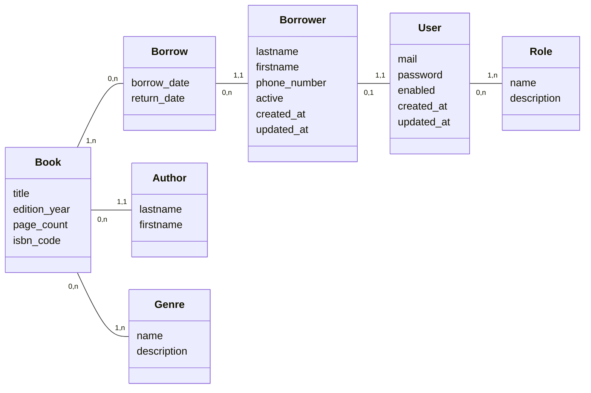

# Modèle des données

## Schema

## Explication des realtions :

Un Role peut avoir entre 0 et n User, un User peut avoir entre 1 et n Roles.
Un Emprunteur doit ếtre associé a un unique User, un User peut etre associé à 0 ou 1 Emprunteur.
Un Emprunt peut etre associé uniquement à un Emprunteur, un Emprunteur peut effectuer entre 0 (à l'inscription) et n Emprunts.
Un Livre peut être associé à entre 0 et n Emprunts, un Emprunts est associé à au moins un Livre.
Un Livre est associé à un unique Auteur (Si l'auteur du Livre est inconnu, on utilise l'auteur avec l'ID 0 : auteur inconnu), un Auteur peut être associé à un nombre de Livres entre 0 et n.
Un Livre doit avoir au moins un Genre (on utilise la meme astuce que pour l'auteur avec un genre 'inclassable'), un Genre peut être associé à entre 0 et n Livres (on peut créer un Genre quand on n'a pas encore de livres de ce genre enregistré).

