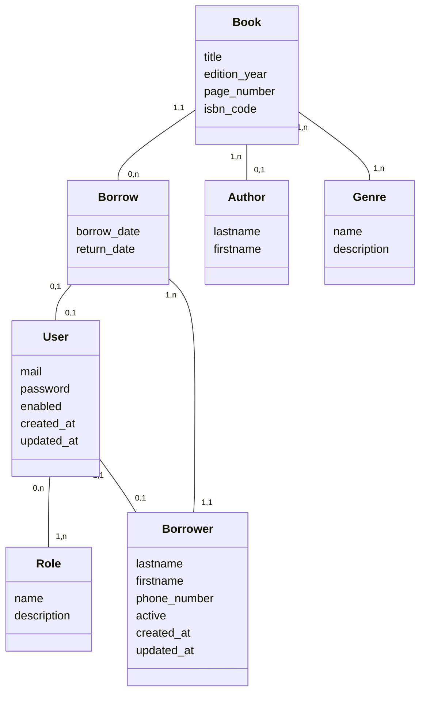

```mermaid
classDiagram
	class Role {
		name
		description
	}
    class User {
		mail
		password
		enabled
		created_at
		updated_at
	}

    class Borrower {
        lastname
        firstname
        phone_number
        active
        created_at
        updated_at
    }
    class Borrow {
        borrow_date
        return_date
    }
    class Book {
        title
        edition_year
        page_number
        isbn_code
    }
    class Author {
        lastname
        firstname
    }
    class Genre {
        name
        description
    }

    User "0,n" -- "1,n" Role
    Borrow "0,1" -- "0,1" User
    Borrow "1,n" -- "1,1" Borrower
    User "1,1" -- "0,1" Borrower
    Book "1,1" -- "0,n" Borrow
    Book "1,n" -- "0,1" Author
    Book "1,n" -- "1,n" Genre
```